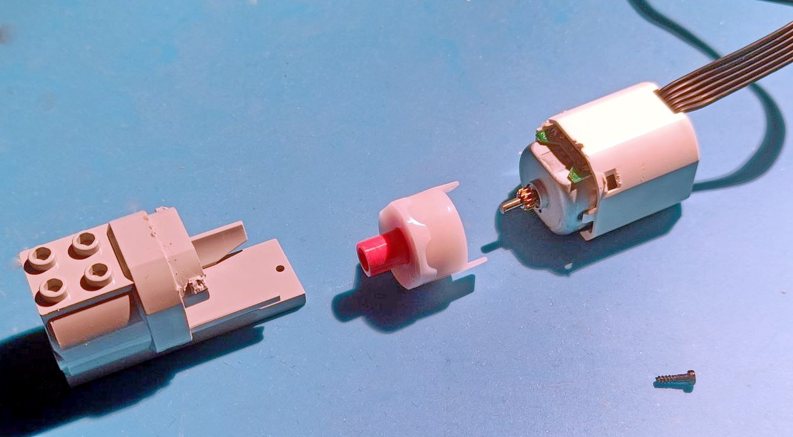
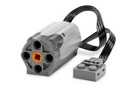
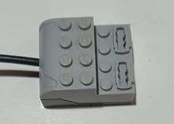
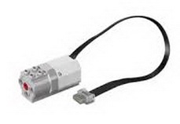
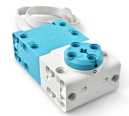

# Reparació-de-Equipament-Lego

L'objectiu es poder reparar elements elèctrics de LEGO sense gaires necessitats tècniques. 

Realitzat per [Jordi Mayné](https://github.com/maynej) des de Mechatronic Study jordi.mayne@mechatronicstudy.com 

La documentació [documentació es pot trobar en PDF](https://github.com/maynej/Reparacio-Equipament-Lego/tree/main/DOC_ESP) 

## Reparació WeDo1

Descripció         | Imatge          | Arxiu PDF    
------------- | ------------- | ------------- 
Motor WeDo 1 | | [Manual Motor Wedo1](DOC_CAT/ReparacioMotorWeDo1_CAT.pdf)
Hub | | [Manual Hub](DOC_CAT/ReparacioHub1.pdf) 

## Reparació WeDo2

Descripció         | Imatge          | Arxiu PDF    
------------- | ------------- | ------------- 
Motor WeDo 2 | | [Manual Motor Wedo2](DOC_CAT/ReparacioMotorWeDo2_CAT.pdf)

## Reparació Spike

Descripció         | Imatge          | Arxiu PDF    
------------- | ------------- | ------------- 
Motor Spike | | [Manual Motor Skipe](DOC_CAT/ReparacioSpike_CAT.pdf)

## Llicéncia

Creative Commons Attribution-NoComercial-ShareAlike 4.0 International (CC BY-NC-SA 4.0)  

## QR

