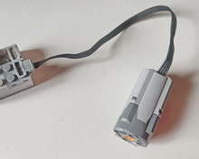
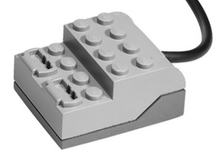

# Reparació-de-Equipament-Lego

L'objectiu es poder reparar elements elèctrics de LEGO sense gaires necessitats tècniques. 

Realitzat per [Jordi Mayné](https://github.com/maynej) des de Mechatronic Study jordi.mayne@mechatronicstudy.com 

La documentació en llengua castellana en PDF es pot trobar en (https://github.com/maynej/Tallers-per-compartir/tree/main/DOC_ESP) 

## WeDo1

Descripció         | Imatge          | Arxiu PDF    
------------- | ------------- | ------------- 
Motor DC | | [Manual Motor Wedo1](DOC_CAT/ReparacioMotorWeDo1.pdf)
Lego Connector | | [Bolígraf 3D](DOC_CAT/ReparacioHub1.pdf) 

## WeDo2

Descripció         | Imatge          | Arxiu PDF    
------------- | ------------- | ------------- 
Motor DC | | [Manual Motor Wedo2](DOC_CAT/ReparacioMotorWeDo2.pdf)

## Llicéncia

Creative Commons Attribution-NoComercial-ShareAlike 4.0 International (CC BY-NC-SA 4.0)  

## QR

